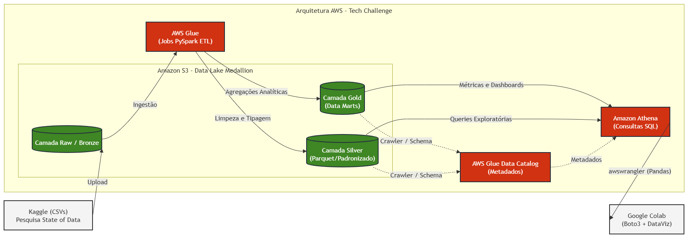

# State-of-Data-Brazil

Este projeto compõe a entrega do Tech Challenge (Fase 3) da PosTech FIAP e tem como objetivo projetar e implementar uma arquitetura de dados moderna baseada em nuvem (AWS) para analisar o cenário dos profissionais de dados no Brasil. O pipeline processa os microdados brutos da pesquisa State of Data Brasil (2023 a 2025), transformando-os em insights estratégicos para contratação, capacitação de profissionais e investimentos em tecnologia.

Foi adotada a Arquitetura Medallion (Bronze, Silver e Gold) para garantir governança, rastreabilidade e performance na disponibilização dos dados. 

Tecnologias Utilizadas

-Armazenamento: Amazon S3 (Data Lake nas camadas Raw, Silver e Gold)

-Processamento (ETL): AWS Glue (PySpark)

-Catálogo de Metadados: AWS Glue Data Catalog

-Consultas Analíticas: Amazon Athena (SQL)

-DataViz & Storytelling: Python (Google Colab, Boto3, Pandas, Seaborn, Matplotlib)
